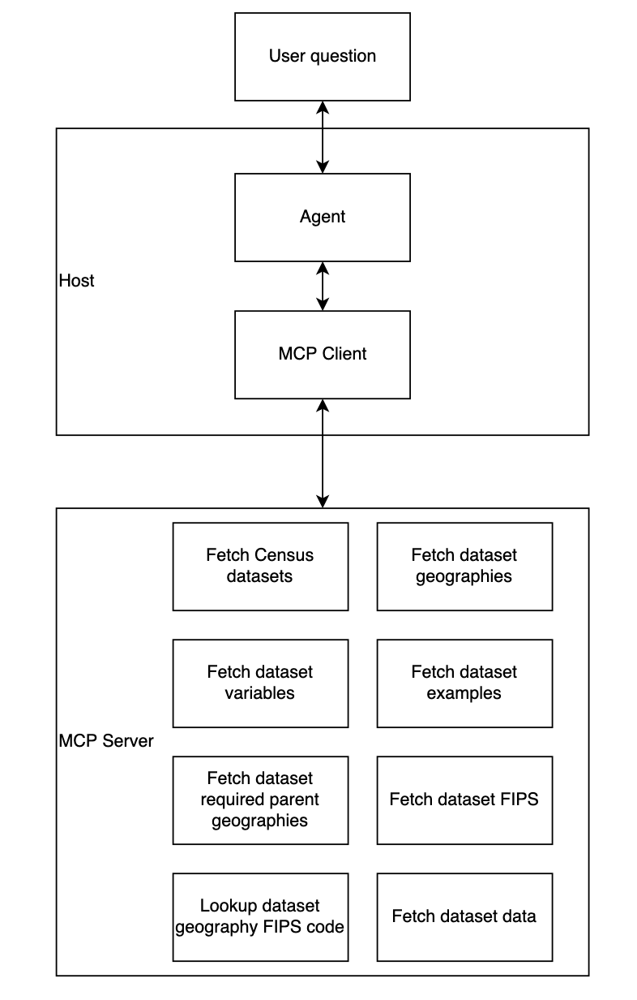

# mcp-census

A work-in-progress MCP server leveraging U.S. Census Bureau tooling for LLM interoperability.

A deployed census MCP server is available at [https://abrezey-mcp-census.hf.space/gradio_api/mcp/sse](https://abrezey-mcp-census.hf.space/gradio_api/mcp/sse). Pushes to the `main` branch of this repo will trigger a redeployment of this resource via GitHub Actions.

This repo was originally built for the [Gradio/Hugging Face Agents MCP Hackathon](https://huggingface.co/Agents-MCP-Hackathon).

## Quickstart

Right now, we recommend using `mcp-census` in conjunction with an MCP Client running a strong foundation model like Claude Desktop or Cursor.

To connect Claude Desktop to the `mcp-census` server hosted on Hugging Face (_requires Claude Pro tier and above_):


To locally run `mcp-census` directly in Claude Desktop, modify your `claude_desktop_config.json`:
```json
{
  "mcpServers": {
    "mcp-census": {
      "command": "uvx",
      "args": [
        "--env-file",
        "/path/to/mcp-census/.env",
        "/path/to/mcp-census",
        "mcp-census"
      ]
    }
  }
}
```

If you prefer to run your own client application and LLM, check out [Local Agent Quickstart](#local-agent-quickstart).

## Example usage

**What is the population of Hennepin County, MN for those who are 65 and older?**

https://github.com/user-attachments/assets/73f53b8a-be57-4bdd-a105-3676f84730de

**What is the racial/ethnic breakdown of Yolo County?**

https://github.com/user-attachments/assets/23c2c9c9-ce79-4fb1-a393-6cd10bdf1eff

**Lookup data from the US 2020 Decennial Census and provide a CSV containing data about the number of housing units, total population, and median age for all counties in New York State. For the column containing the county identifier, please provide a complete FIPS containing the state and county as a joined value.**

https://github.com/user-attachments/assets/8c9fac39-0beb-4f27-97b2-430cb4b20465

## Local MCP server local development

We suggest using [`uv`](https://docs.astral.sh/uv/) to manage dependencies, but you can install the required packages directly from the [`pyproject.toml` file](pyproject.toml)

Linting and formatting provided by [`ruff`](https://docs.astral.sh/ruff/) and [`pre-commit`](https://pre-commit.com/)
```zsh
uv run pre-commit install
```

The `mcp` package provides a handy dev server where you can test functions via UI.
```zsh
npx @modelcontextprotocol/inspector uv run mcp-census
```

## API Keys

`mcp-census` requires an API key in order to request data from U.S. Census Bureau servers.

```zsh
cp .env.example .env
```

Then fill out your API keys

To request a census API key, visit https://api.census.gov/data/key_signup.html. To request a Hugging Face token, visit https://huggingface.co/docs/hub/security-tokens.

The MCP server does not require a Hugging Face token, though it becomes useful during agent development.

## Gradio MCP server local development

```zsh
uv run --group gradio-deployment python gradio_app.py
```

Assuming you have no other Gradio applications running, this will serve your MCP server at http://localhost:7860/gradio_api/mcp/sse

To update dependencies for the Gradio deployment

```zsh
uv export --group gradio-deployment > requirements.txt
```

## Local Agent Quickstart

You need to start all three applications (MCP server, Agent, Phoenix) for the system to work at the moment.

### Agent (and MCP client)

```zsh
uv run --group agent python agent.py
```

### Observability

When debugging Agents, observability is key. The agent is currently configured to send logs to a phoenix server.

```zsh
uv run python -m phoenix.server.main serve
```

The agent will not work without this server running.

## MCP architecture



## Roadmap

### Evaluation

* In order to systematically improve MCP server and client performance we recommend creating a strong benchmark with which to evaluate changes.
* MCP server tools can be evaluated via unit tests. Client and agentic behavior can be evaluated on criteria described [here](https://hamel.dev/blog/posts/evals/) and emerging frameworks such as [RAGAS](https://docs.ragas.io/en/stable/).

### MCP Server

* The Census Bureau publishes myriad documentation. Enabling semantic retrieval via RAG should provide agents with information to better respond to user queries.

### Agent

1. Agentic Behavior can be fine tuned via foundation model choice, prompting as well as introduction of additional tooling such as data exporting. The exact optimizations may depend on intended use case.
2. Improved citations of census bureau documentation.
