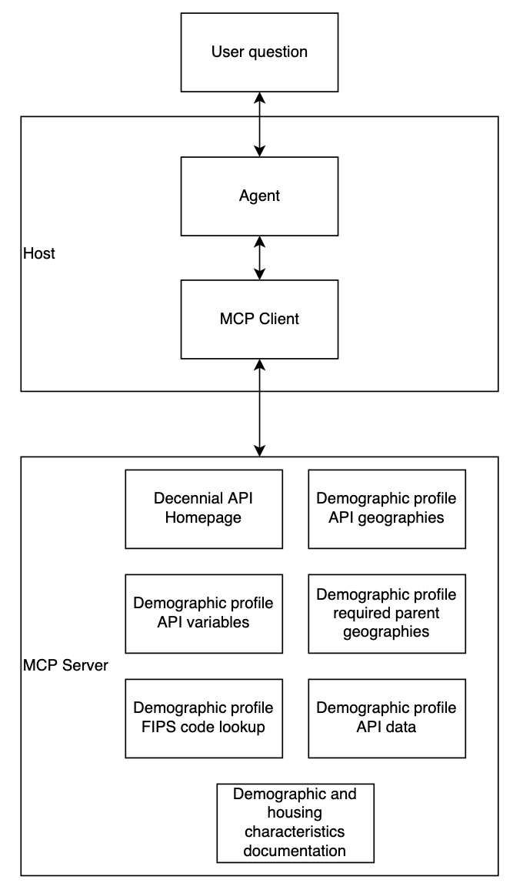

# mcp-census

Proof of concept for an MCP Server delivering Census Bureau data for LLM interoperability.

This repo was built for the [Gradio/Hugging Face Agents MCP Hackathon](https://huggingface.co/Agents-MCP-Hackathon). It relies on [`smolagents`](https://github.com/huggingface/smolagents) and [`gradio`](https://github.com/gradio-app/gradio). It pulls heavily from the lovely [smolagents](https://huggingface.co/agents-course) and [mcp](https://huggingface.co/learn/mcp-course/unit0/introduction) courses published by Hugging Face.

This project is a work in progress. A deployed version of the mcp server is available at [https://agents-mcp-hackathon-hackathon-census-mcp-server.hf.space/](https://agents-mcp-hackathon-hackathon-census-mcp-server.hf.space/) while we work on deploying the agent. 

## Quickstart

We suggest using [`uv`](https://docs.astral.sh/uv/) to manage dependencies, but you can install the required packages directly from the [`pyproject.toml` file](pyproject.toml)

You need to start all three applications (MCP server, Agent, Phoenix) for the system to work at the moment.

##  API Key

```zsh
cp .env.example .env
```

Then fill out your API keys

To request a census API key, visit https://api.census.gov/data/key_signup.html
To request a Hugging Face token, visit https://huggingface.co/docs/hub/security-tokens

### MCP server

```zsh
uv run python mcp_server/app.py
```

Assuming you have no other gradio applications running, this will serve your MCP server at http://localhost:7860/gradio_api/mcp/sse

### Agent (and MCP client)

```zsh
uv run python app.py
```

### Observability

When debugging Agents, observability is key. The agent is currently configured to send logs to a phoenix server.

```zsh
uv run python -m phoenix.server.main serve
```

## MCP architecture



## Possible improvements

### Evaluation

* We recommend starting here to provide a strong benchmark with which to evaluate improvements.
* MCP server tools can be evaluated via unit tests. Agentic behavior can be evaluated on criteria described [here](https://hamel.dev/blog/posts/evals/) and emerging frameworks such as [RAGAS](https://docs.ragas.io/en/stable/).

### MCP Client

* Rather than build tool sets for every Census dataset (decennial, american community survey, etc.), it may be more comprensive to build tooling around the [machine readable dataset discovery tool](https://www.census.gov/data/developers/updates/new-discovery-tool.html).
* The Census Bureau publishes myriad documentation. Enabling semantic retrieval via RAG should provide agents with information to better respond to user queries.

### Agent

* Agentic Behavior can be fine tuned via foundation model choice, prompting as well as introduction of additional tooling such as data exporting. The exact optimizations may depend on intended use case.
* Improved citations of census bureau documentation. 
